# Eliveryday

An Android Food delivery with Map integration and Firebase app built using flutter 

# Technologies 
Flutter and Firebase

# Requirements

Basic Flutter Setup with Android SDK

# Setup

Add the Google API key to local.properties

### API Setup

```
google.map.key = AIzaS************
```

Add mapbox search API key by creating a new file
lib/Maps/mapboxAPI.dart

```
final kApiKey =
    'pk.eyJ*********************';
```


### Firebase Setup
Create a new project along with SHA-1 keys in firebase console
You can find instructions for doing that in the official [Firebase docs](https://firebase.google.com/docs/flutter/setup?platform=android). Be sure to include your SHA-1 key when you’re adding your Android app to the Firebase console you can find instructions for finding your SHA-1 in [Android’s official docs](https://developers.google.com/android/guides/client-auth)

#### Phone Auth
head to sign-in methods and turn on phone number

#### Firestore
create collections 'users' and 'carts'

# Screenshots

### Initial View
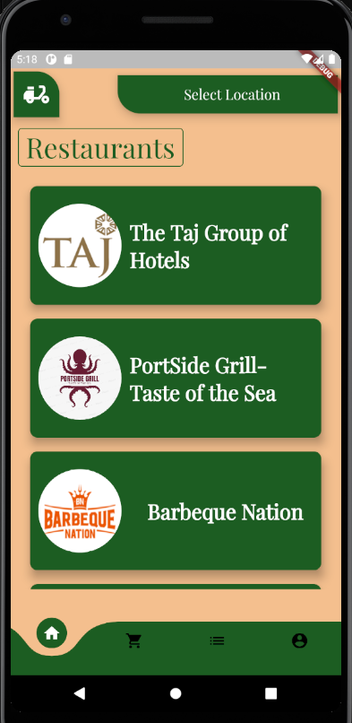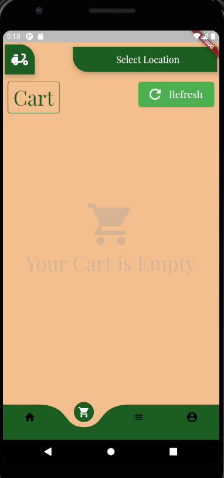
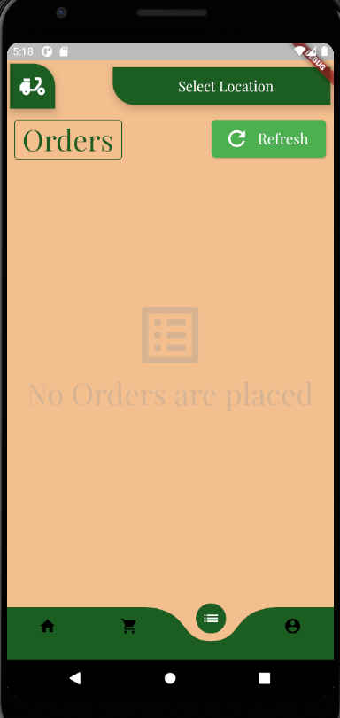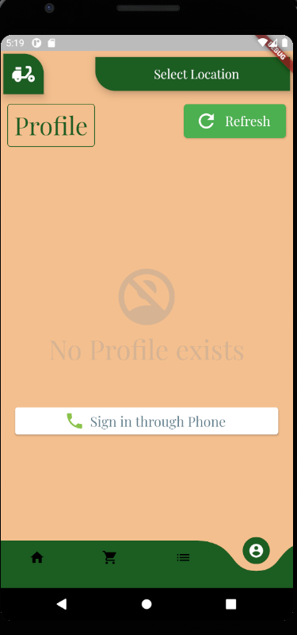

### Restuarants
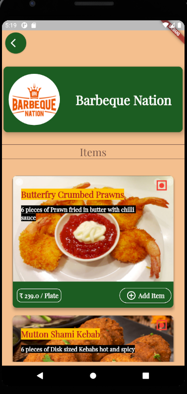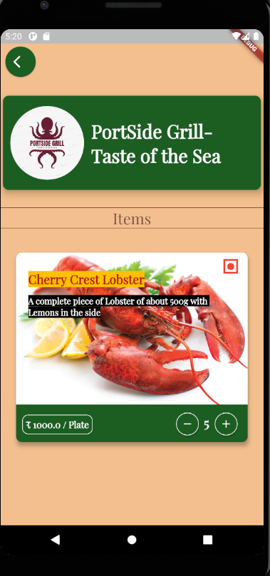

### During Order

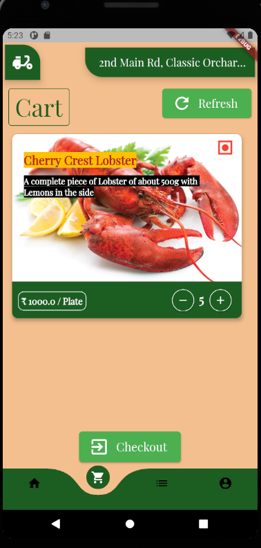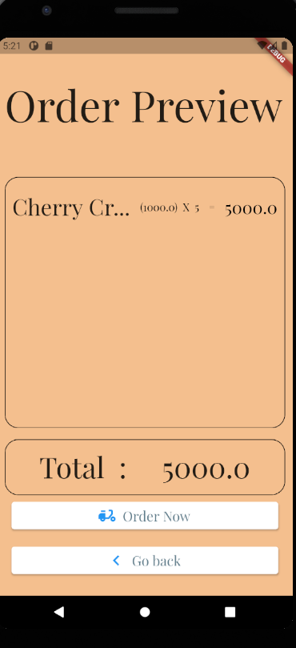
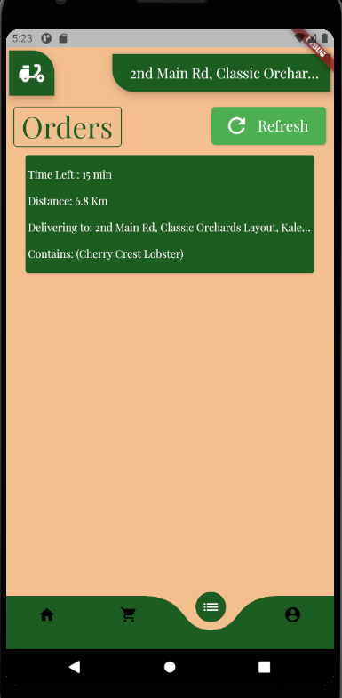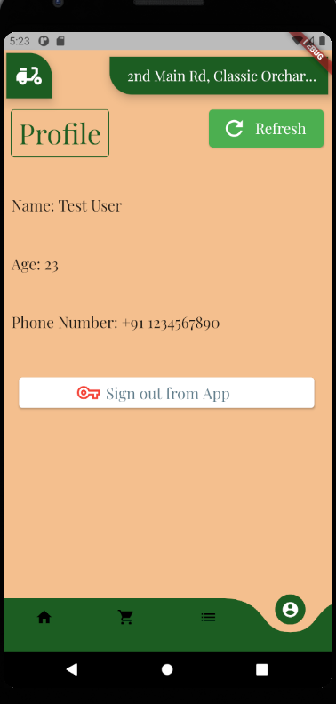

### Choosing Delivery Location


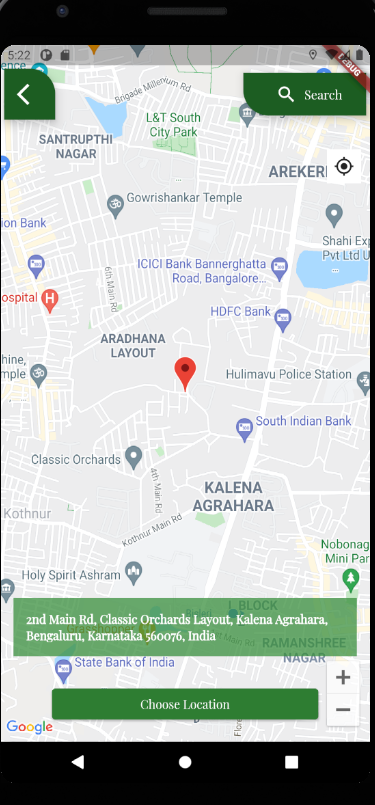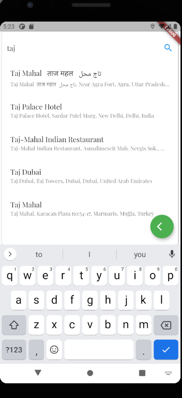

### Phone Auth and Profile

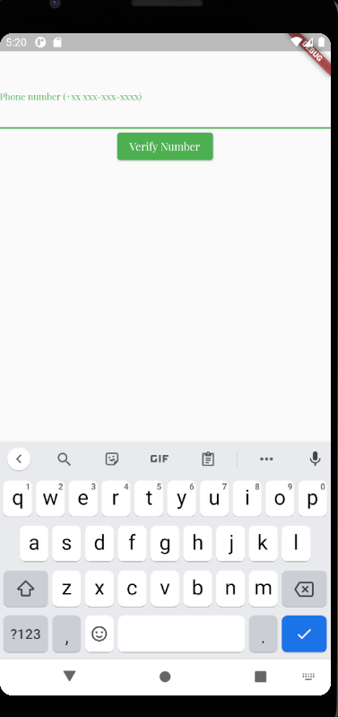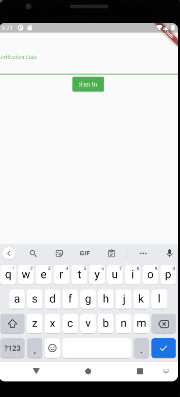
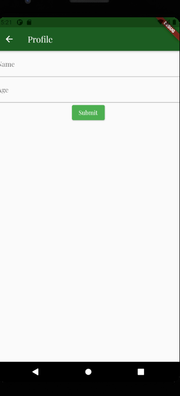

### Order Display on Maps

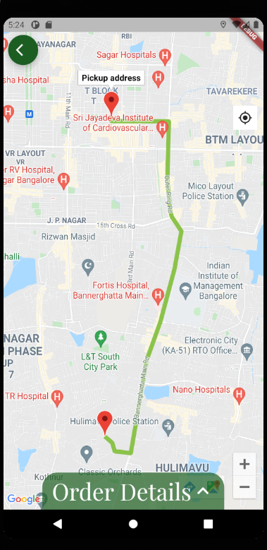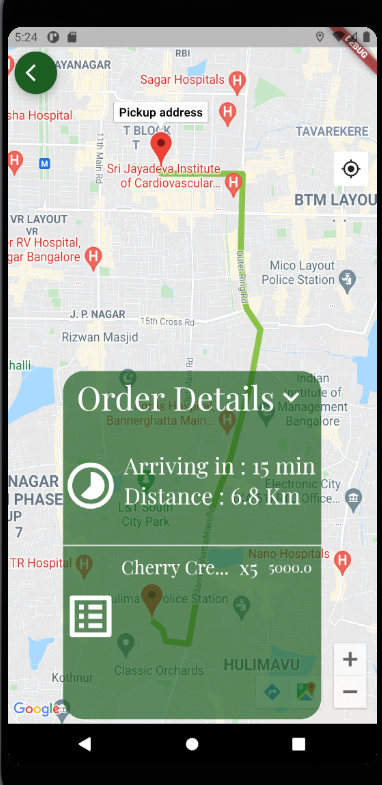

### Firebase display

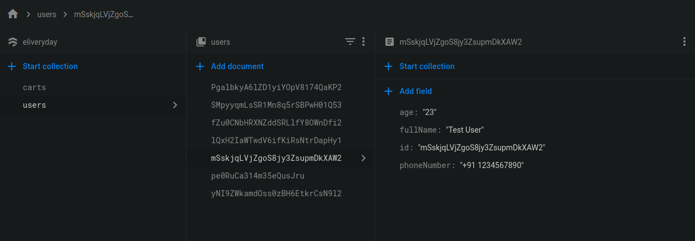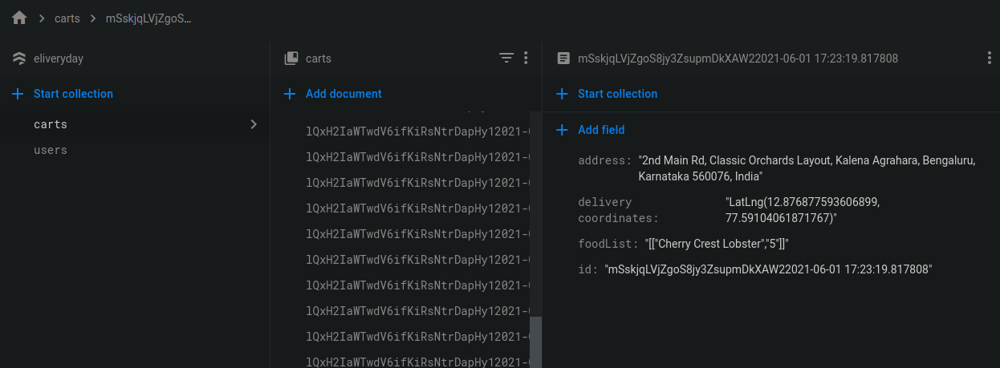


